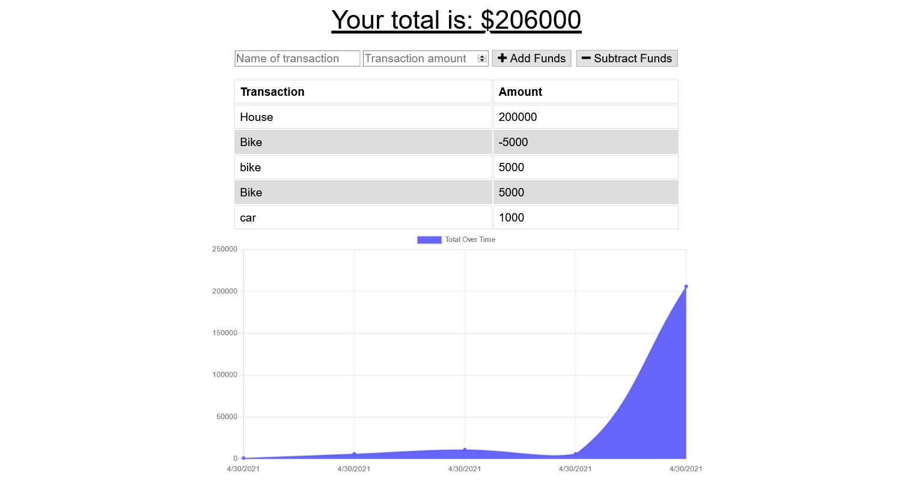

  # Title
  ## Budget-Tracker
  
  
  ## Table of contents 
  - [Description](#description)
  - [Installation](#installation)
  - [Usage Information](#usage-information)
  - [Screenshot](#screenshot)
  
  
  ## Description
     This application built by using nodejs, express, and mongoose. This application structure follows the Model-View-Controller pattern where controller as routes, and mongoose is used. Overall, this Keep track of all budgets spend over time (on date), it shows the transaction happened over time. 
     user can add and track new budget for specific items such as spend on car, house or any user stuff.     

  ## Installation
     first need to clone from given github link and need to perform 'npm i' on terminal within the project location. 
     Second, type on terminal 'npm run seed' to get test for application if not then you can put your own data or 
     use application to create data.
     Third, 'npm run seed' to insert the dummy data useful to check application 
     fourth, 'node server.js' or 'npm start' to run the actual application. 
     Finally, the application will run and allows blogging.

  ## Usage Information
     It is useful to observe the transaction happened over time, user take as reference and able to plan the budget allocation for future items by tracking the transaction through line shaded graph.

     
  ## Screenshot
  ### welcome Screen
  

  
    